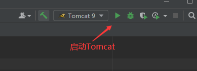

JavaWeb

### 1 基本概念

#### 1.1前言

web开发：

+ 静态web：html css
  + 提供给所有人看的数据始终不会发生变化
+ 动态web:
  + 提供给所有人看的数据会发生变化
  + 几乎所有网站都是动态web
  + 常用技术栈：Servlet/JSP ASP PHP 

在java中，动态web资源开发的技术统称为javaweb

#### 1.2 web应用程序

web应用程序：指的是可以提供浏览器访问的程序

+ 平时能访问到的任何一个页面或者资源，都存在于这个世界的某一个角落的计算机上
+ URL
+ 这个同一的web资源都会被放在同一个文件夹下，web应用程序 --》Tomcat:服务器
+ 一个web应用由多部分组成（静态Web \ 动态Web）
  + html css js 
  + jsp servlet
  + java程序
  + jar包
  + 配置文件（properties）

web应用程序编写完成后，若想提供给外界访问：需要一个服务器来统一管理；

#### 1.3 静态Web

+ *.html *.htm 这些都是网页的后缀，如果服务器上一直存在这些东西，我们就可以直接进行读取，

==静态web存在的缺点==

+ Web页面无法动态更新，所有用户看到的都是同一个页面
+ 轮播图，点击特效：伪动态
  + JavaScript
  + VBscript
+ 无法和数据库交互（数据无法持久化，用户无法交互）

#### 1.4 动态Web

页面会动态展示：“Web的页面展示的效果因人而异”


**缺点**：

+ 假如服务器的动态web资源出现了错误，我们需要重新编写我们的**后台程序**，重新发布——停机维护

**优点：**

+ Web页面可以动态更新，所有用户看到都不是同一页面
+ 可以与数据库交互（数据持久化：注册，商品信息，用户信息.....）


### 2 Web服务器

#### 2.1 技术相关

ASP:微软做的，国内最早流行的就是ASP.ASP就是在HTML中嵌入了VB脚本，ASP+COM

​		在ASP开发中基本一个页面都有几千行的业务代码，页面及其混乱

​		维护成本高

​		C#

​		IIS


 JSP/Servlet:sun公司主推的B/S（浏览和服务器）架构

​						基于java语言的（公司或一些开源的组件都是用java写的）

​						可以承载三高问题带来的影响

​						语法像ASP

 PHP：开发速度快，功能强大，跨平台，代码简单

​			无法承载大量访问的情况

#### 2.2 服务器相关

服务器是一种被动的操作，用来处理用户的一些请求和给用户一些响应信息


**IIS**


**Tomcat：**Tomcat是Apache 软件基金会的[Jakarta](https://baike.baidu.com/item/Jakarta/15952232?fromModule=lemma_inlink) 项目中的一个核心项目，由于有了Sun 的参与和支持，最新的Servlet 和[JSP](https://baike.baidu.com/item/JSP/141543?fromModule=lemma_inlink) 规范总是能在Tomcat 中得到体现，Tomcat 技术先进、性能稳定，而且免费，因而成为比较流行的Web [应用服务器](https://baike.baidu.com/item/应用服务器/4971773?fromModule=lemma_inlink)。

​					Tomcat 服务器是一个免费的[开放源代码](https://baike.baidu.com/item/开放源代码/114160?fromModule=lemma_inlink)的[Web](https://baike.baidu.com/item/Web/150564?fromModule=lemma_inlink) 应用服务器，属于轻量级应用服务器，在中小型系统和并发访问用户不是很多的场合下被普遍使用，是开发和调试JSP 程序的首选。

​					Tomcat 实际上运行JSP 页面和Servlet。Tomcat最新版本为10.0.23**。**

### 3 Tomcat

#### 3.1 Tomcat安装

https://tomcat.apache.org/


#### 3.2 Tomcat 启动和配置

文件夹信息


**启动.关闭Tomcat**

+ bin文件目录下——》startup.bat文件双击启动


+ bin文件目录下——》shutdown.bat文件双击关闭


**访问测试**：http://localhost:8080/

可能遇到的问题：

+ 1.java环境变量没有配置
+ 闪退问题：需要配置兼容性
+ 乱码：配置文件中设置

#### 3.3 配置


**可以配置启动的端口号**

Tomcat默认的端口号：8080

mysql：3306

http：80

https：443


```xml
<Connector port="8080" protocol="HTTP/1.1"
               connectionTimeout="20000"
               redirectPort="8443" />
```

可以配置主机的名称

+ 默认的主机名为：localhost
+ 默认网站应用存放的位置：webapps

```xml
<Host name="localhost"  appBase="webapps"
   unpackWARs="true" autoDeploy="true">
```

==面试题（高难度）==：

网站是如何进行访问的？

1 输入域名——》回车

2 检查本机的C:\Windows\System32\drivers\etc\hosts配置文件下有没有这个域名映射；


 		有——》直接返回对应的ip地址，这个地址中有我们需要访问的web程序，可以直接访问

​		没有——》就去DNS服务器找，找到的话就返回，找不到就报错


#### 3.4 发布一个Web网站


+ 将自己写的网站放到服务器（Tomcat）中指定的web应用的文件夹（webapps）下就可以访问了，网站应有的结构

  ```java
  --webapps ; Tomcat服务器的web目录
  	-ROOT
  	-kuangstudy：网站的目录名
  		-WEB-INF
  			-classes：java程序
  			-lib：web应用所依赖的jar包
  			-web.xml ; 网站配置文件
  		- index.html 默认的首页
  		- static 
  			- css
  				-style。css
  			-js
  			-img
              - ......
  ```

  

### 4 http

#### 4.1 什么是HTTP

超文本传输协议（Hyper Text [Transfer Protocol](https://baike.baidu.com/item/Transfer Protocol/612755?fromModule=lemma_inlink)，HTTP）是一个简单的请求-响应协议，它通常运行在[TCP](https://baike.baidu.com/item/TCP/33012?fromModule=lemma_inlink)之上。

文本：html,字符串

超文本：图片，音乐，视频....

**http默认端口**：80

**https默认端口**：443（s：secure 安全）

#### **4.2 两个时代**

+ http 1.0

​			http/1.0:客户端可以与web服务器连接，只能获得一个web资源，断开连接

+ http 2.0

​			http/1.1：客户端可以与web服务器连接，可以获得多个web资源

​			

#### 4.3 Http请求

+ 客户端--发请求--服务器

以百度为例

```java
Request URL: https://www.baidu.com/   请求地址
Request Method: GET     get方法/post方法
Status Code: 200 OK     状态码：200
Remote Address: 36.152.44.96:443    远程地址
Referrer Policy: strict-origin-when-cross-origin
```

```java
Accept: text/html
Accept-Encoding: gzip, deflate, br
Accept-Language: zh-CN,zh;q=0.9   语言
Connection: keep-alive

```

1、 **请求行**

+ 请求行中的请求方式：GET
+ 请求方式：GET/POST ，HEAD,DELETE,PUT,TRACT...
  + get：一次请求能够携带的参数比较少，大小有限制，会在浏览器的URL地址栏显示数据内容，不安全，但高效
  + post：一次请求能够携带的参数没有限制，大小无限制，不会在浏览器的URL地址栏显示数据内容，安全，但不高效

2、**消息头**


```
Accept：告诉浏览器它所支持的类型
Accept-Encoding：支持哪种编码格式   GBK UTF-8 GB2312
Accept-Language：告诉浏览器它的语言环境
Cache-Control：缓存控制
Connection：告诉浏览器，请求完成是断开还是保持连接
HOST：主机。。。
```


#### 4.4 Http响应

+ 服务器--发请求--客户端

以百度为例

```java

Cache-Control: private     缓存控制
Connection: keep-alive     连接
Content-Encoding: gzip		编码
Content-Type: text/html 	类型
```

1 **响应体**

```
Accept：告诉浏览器它所支持的类型
Accept-Encoding：支持哪种编码格式   GBK UTF-8 GB2312
Accept-Language：告诉浏览器它的语言环境
Cache-Control：缓存控制
Connection：告诉浏览器，请求完成是断开还是保持连接
HOST：主机。。。
Reflush：告诉客户端多久刷新，定时刷新
Location：让网页重新定位
```

2 **响应状态码**

200：代表请求成功

3××：请求重定向

404：找不到资源

5××：服务器代码错误

**常见面试题：当浏览器地址栏中输入地址并回车的一瞬间到页面能够展示回来，经历了什么？**


### 5 Maven

#### 5.1 Maven项目架构管理工具

用来方便导入jar包

Maven的核心思想：约定大于配置

+ 制定的规则一定要照做

Maven会规定好如何去编写java代码

#### 5.2 下载安装maven

官网下载完解压即可

#### 5.3 配置环境变量

在系统环境变量中，配置如下配置：

+ M2_HOME  MAVEN目录下的bin目录
+ MAVEN_HOME  maven的目录
+ 在系统的path中配置MAVEN_HOME   bin目录

测试Maven是否安装成功：

+ cmd终端 —— mvn -version

  

#### 5.4 阿里云镜像

阿里云镜像

```
	<mirror>
      <id>alimaven</id>
      <mirrorOf>central</mirrorOf>
      <name>aliyun maven</name>
      <url>http://maven.aliyun.com/nexus/content/groups/public</url>
    </mirror>
```


#### 5.5 本地仓库


#### 5.6 在IDEA中使用Maven

1 启动IDEA

2 创建一个Maven项目

https://blog.csdn.net/hgnuxc_1993/article/details/125427590?ops_request_misc=&request_id=&biz_id=102&utm_term=idea2022%E7%89%88%E5%88%9B%E5%BB%BAmaven%E9%A1%B9%E7%9B%AE&utm_medium=distribute.pc_search_result.none-task-blog-2~all~sobaiduweb~default-0-125427590.142^v73^insert_down3,201^v4^add_ask,239^v2^insert_chatgpt&spm=1018.2226.3001.4187

3 搭建成功


4 创建一个普通的Maven项目


#### 5.7 在IDEA中标记文件夹功能


#### 5.8 在IDEA中配置Tomcat


解决警告问题：


==为什么会有这个问题==

我们访问一个网站，需要指定一个文件夹名字（必须要的）





Maven结构：


#### 5.9 pom文件

pom.xml是Maven的核心配置文件，

```xml
<!--Ctrl+Shift+/ 快速注释-->
<!--maven版本和头文件 -->
<project xmlns="http://maven.apache.org/POM/4.0.0" xmlns:xsi="http://www.w3.org/2001/XMLSchema-instance"
  xsi:schemaLocation="http://maven.apache.org/POM/4.0.0 http://maven.apache.org/maven-v4_0_0.xsd">
  <modelVersion>4.0.0</modelVersion>

  <!--这里就是配置的GAV-->
  <groupId>com.lk</groupId>
  <artifactId>maventest</artifactId>
  <!--package：项目的打包方式
  jar：java应用
  war：javaweb应用-->
  <packaging>war</packaging>
  <version>1.0-SNAPSHOT</version>


  <name>maventest Maven Webapp</name>
  <url>http://maven.apache.org</url>

  <!--项目依赖-->
  <dependencies>
    <!--具体依赖的jar包配置文件-->
    <dependency>
      <groupId>junit</groupId>
      <artifactId>junit</artifactId>
      <version>3.8.1</version>
      <scope>test</scope>
    </dependency>
  </dependencies>
  
  <!--项目构建用的东西-->
  <build>
    <finalName>maventest</finalName>
  </build>
  
</project>
```


Maven由于它的约定大于配置，之后可能会遇到自己写的配置文件无法被导出或者生效的问题，**解决方案**

```xml
<!--在build中配置resources，防止我们资源导出失败的问题-->
    <build>
        <resources>
            <resource>
                <directory>src/main/resources</directory>
                <excludes>
                    <exclude>**/*.properties</exclude>
                    <exclude>**/*.xml</exclude>
                </excludes>
                <filtering>false</filtering>
            </resource>
            <resource>
                <directory>src/main/java</directory>
                <includes>
                    <include>**/*.properties</include>
                    <include>**/*.xml</include>
                </includes>
                <filtering>false</filtering>
            </resource>
        </resources>
    </build>
```

#### 5.10 Maven配置及Tomcat部署可能碰到的问题 P7

+ IDEA创建maven项目后没有.iml文件
+ 在Terminal中输入命令

```java
mvn idea:module
```


+ 

```
Unable to import maven project:see logs for details
```

尝试降低Tomcat版本，重新配置本地仓库，镜像和系统环境变量

+ Tomcat闪退
+ IDEA中每次都要重复配置Maven
  + 在IDEA中的全局默认配置中去配置
+ Maven项目中Tomcat无法配置

+ Maven默认web项目中的web.xml版本问题
  + 

IDEA中web项目的web-app默认版本是2.3

Tomcat文件夹默认的webapp中的ROOT文件中的web.xml中的配置情况

web-app 版本为4.0


将IDEA中webapp版本改为4.0和Tomcat保持一致可以避免某些问题出现。

```xml
<web-app xmlns="http://xmlns.jcp.org/xml/ns/javaee"
  xmlns:xsi="http://www.w3.org/2001/XMLSchema-instance"
  xsi:schemaLocation="http://xmlns.jcp.org/xml/ns/javaee
                      http://xmlns.jcp.org/xml/ns/javaee/web-app_4_0.xsd"
  version="4.0"
  metadata-complete="true">
```

+ maven仓库的使用
  + 地址：https://mvnrepository.com/
  + 

一般选取使用次数多的。


### 6 Servlet

#### 6.1 Servlet简介

+ Servlet就是SUn公司开发动态web的一门技术，
+ sun公司在这些API中提供了一个接口叫做：Servlet，如果想要开发一个Servlet程序，只需要完成：
  + 1 编写一个类，实现Servlet接口
  + 2 把开发好的JAVA类部署到WEB服务器当中

**把实现了Servlet接口的java程序叫做Servlet**

#### 6.2 **HelloServlet**

Servlet接口在SUN公司有两个默认的实现类：HttpServlet和GenericServlet

==**1** 创建一个普通的maven项目==，删掉里面的src目录，以后的学习就在这个项目里建立Module：这个空的工程就是Maven的主工程

==2 **关于Maven父子工程的理解**==

父项目中会有

```xml
<modules>
        <module>servlet-01</module>
    </modules>
```

子项目中会有

```xml
 <parent>
        <artifactId>javaweb-02-servlet</artifactId>
        <groupId>com.lk</groupId>
        <version>1.0-SNAPSHOT</version>
    </parent>
```


父项目中的java子项目可以直接使用

```java
son extends father
```

==3 **Maven环境优化**==

+ 修改子项目中webapp配置文件web.xml为最新配置

```xml
<?xml version="1.0" encoding="UTF-8"?>
<web-app xmlns="http://xmlns.jcp.org/xml/ns/javaee"
         xmlns:xsi="http://www.w3.org/2001/XMLSchema-instance"
         xsi:schemaLocation="http://xmlns.jcp.org/xml/ns/javaee
                      http://xmlns.jcp.org/xml/ns/javaee/web-app_4_0.xsd"
         version="4.0"
         metadata-complete="true">
</web-app>

```


+ 将maven结构搭建完整，新建java 和 resources项目


==4  编写Servlet程序==

+ 编写一个普通类

+ 实现Servlet接口，这里直接继承HttpServlet

  

```java
public class HelloServlet extends HttpServlet {

    //由于get或者post只是请求实现的不同的方式，可以相互调用，业务逻辑一样
    @Override
    protected void doGet(HttpServletRequest req, HttpServletResponse resp) throws ServletException, IOException {
        // ServletOutputStream outputStream = resp.getOutputStream();
        PrintWriter writer = resp.getWriter();  //响应流

        writer.print("Hello,Servlet");

    }

    @Override
    protected void doPost(HttpServletRequest req, HttpServletResponse resp) throws ServletException, IOException {
        super.doPost(req, resp);
    }
}

```

==5 编写Servlet的映射==

为什么需要映射：写的是Java程序，但是要通过浏览器访问，而浏览器需要连接web服务器，所以需要在web服务器中注册我们写的Servlet，还需要给他一个浏览器能够访问的路径

```xml
    <!--注册Servlet-->
    <servlet>
        <servlet-name>hello</servlet-name>
        <servlet-class>com.lk.servlet.HelloServlet</servlet-class>
    </servlet>
    <!--Servlet的请求路径-->
    <servlet-mapping>
        <servlet-name>hello</servlet-name>
        <url-pattern>/hello</url-pattern>
    </servlet-mapping>
```

==6 配置Tomcat==

注意配置项目发布的路径就OK

==7 启动测试==

#### 6.3 运行原理

Servlet是由Web服务器调用，Web服务器在收到浏览器请求之后，会：


#### 6.4 Mapping问题

+ 1、一个Servlet可以指定一个映射路径
+ 2、一个Servlet可以指定多个映射路径
+ 3、 一个Servlet可以指定通用映射路径
+ 4、 一个Servlet可以自定义后缀实现请求映射

```xml
    <!--自定义后缀实现请求映射-->
    <!--注意*前面不能加映射的路径-->
    <servlet-mapping>
        <servlet-name>hello</servlet-name>
        <url-pattern>*.lk</url-pattern>
    </servlet-mapping>
```


+ 5、优先级问题
+ 指定了固有的映射路径，优先级最高，如果找不到就会走默认的处理i请求

```xml
    <!--404-->
    <servlet>
        <servlet-name>error</servlet-name>
        <servlet-class>com.lk.servlet.ErrorServlet</servlet-class>
    </servlet>
    <servlet-mapping>
        <servlet-name>error</servlet-name>
        <url-pattern>/*</url-pattern>
    </servlet-mapping>

    <!--hello-->
 <servlet>
        <servlet-name>hello</servlet-name>
        <servlet-class>com.lk.servlet.HelloServlet</servlet-class>
    </servlet>
    <!--Servlet的请求路径-->
    <servlet-mapping>
        <servlet-name>hello</servlet-name>
        <url-pattern>/hello</url-pattern>
    </servlet-mapping>
```

localhost:8080/s1/hello 访问 HelloServlet

localhost:8080/s1/sjkhjkja 访问 404


#### 6.5 ServletContext

web容器启动的时候，会为每个web程序都创建一个ServletContext对象，代表了当前的web应用

##### **共享数据**

我在这个Servlet中保存的数据，可以在另外一个servlet


第一步：存数据   setAttribute("username",username);

```java
  //HelloServlet
protected void doGet(HttpServletRequest req, HttpServletResponse resp) throws ServletException, IOException {
       // this.getInitParameter()   初始化参数
       // this.getServletConfig()   Servlet配置
       // this.getServletContext()  Servlet上下文
        ServletContext servletContext = this.getServletContext();
        String username = "胡晓飞";  //数据
        servletContext.setAttribute("username",username);  //将一个数据保存在了ServletContext中，名字 username 值 username
    }
```

第二步：从ServletContext获取数据  页面编码和文本类型需要设置，如果不设置将会显示为问号，字符无法识别


==null==：null的原因是因为ServletContex中还没有存储任何东西

```java
//GetServlet
public class GetServlet extends HttpServlet {
    @Override
    protected void doGet(HttpServletRequest req, HttpServletResponse resp) throws ServletException, IOException {
        ServletContext servletContext = this.getServletContext();
        String username = (String) servletContext.getAttribute("username");
        resp.setContentType("text/html");
        resp.setCharacterEncoding("utf-8");
        resp.getWriter().print("名字"+username);
    }
```

HelloServlet 实现存数据，GetServlet实现获取数据

```xml
    <servlet>
        <servlet-name>hello</servlet-name>
        <servlet-class>com.lk.servlet.HelloServlet</servlet-class>
    </servlet>
    <servlet-mapping>
        <servlet-name>hello</servlet-name>
        <url-pattern>/hello</url-pattern>
    </servlet-mapping>

    <servlet>
        <servlet-name>getc</servlet-name>
        <servlet-class>com.lk.servlet.GetServlet</servlet-class>
    </servlet>
    <servlet-mapping>
        <servlet-name>getc</servlet-name>
        <url-pattern>/getc</url-pattern>
    </servlet-mapping>
</web-app>
```

##### **获取初始化参数**

```xml
    <!--配置一些web应用的初始化参数-->
	<context-param>
        <param-name>url</param-name>
        <param-value>jdbc:mysql://localhost:3306/mybatis</param-value>
    </context-param>
```


从web,xml中获取配置的一些参数

```java
protected void doGet(HttpServletRequest req, HttpServletResponse resp) throws ServletException, IOException {
        ServletContext servletContext = this.getServletContext();
        String url = servletContext.getInitParameter("url");
        resp.getWriter().print(url);
        }
```


##### **请求转发**


```java
//Demo4
public class ServletDemo4 extends HttpServlet {
    @Override
    protected void doGet(HttpServletRequest req, HttpServletResponse resp) throws ServletException, IOException {
        ServletContext servletContext = this.getServletContext();
        System.out.println("进入了demo4");
        RequestDispatcher requestDispatcher = servletContext.getRequestDispatcher("/url"); //转发的请求路径
        requestDispatcher.forward(req,resp);  //调用forward实现请求转发

    }
}
```

```xml
    <servlet>
        <servlet-name>rd</servlet-name>
        <servlet-class>com.lk.servlet.ServletDemo4</servlet-class>
    </servlet>
    <servlet-mapping>
        <servlet-name>rd</servlet-name>
        <url-pattern>/rd</url-pattern>
    </servlet-mapping>
```

访问LocalHost:8080/s2/rd 通过请求转发 实际访问到了 /url


##### **读取资源文件**

Properties

+ 在java目录下新建properties
+ 在resources目录下新建properties

​		发现：被打包到了同一个路径下：classes，俗称这个路径为classpath


pom文件中添加resources配置，解决自己写的配置文件无法被导出或者生效的问题

配置中包含两个resource，分别指定 src/main/resources 和 src/main/java 两个路径，针对.properties和.xml配置文件，经测试，分别在两个路径下添加properties文件，如下图，


运行后发现自己所写的 .properties 文件确实被打包在了classes文件目录下，但只有src/main/java路径下的文件被打包，db.properties文件找不到了


解决方法（原因未知）：pom文件中不要配置resources路径，resources路径下写的配置文件本来就会被打包到classes路径下，在pom配置文件中写了反而没有被打包，将第一个resource配置内容删去


读取资源测试

```java
public class ServletDemo05 extends HttpServlet {
    @Override
    protected void doGet(HttpServletRequest req, HttpServletResponse resp) throws ServletException, IOException {
        InputStream is = this.getServletContext().getResourceAsStream("/WEB-INF/classes/db.properties");
        Properties prop = new Properties();
        prop.load(is);
        String user = prop.getProperty("username");
        String pwd = prop.getProperty("password");

        resp.getWriter().print(user + ":" +pwd);
    }

    @Override
    protected void doPost(HttpServletRequest req, HttpServletResponse resp) throws ServletException, IOException {
        doGet(req, resp);
    }
}
```

#### 6.6 HttpServletResponse

web服务器接收到客户端的Http请求，针对这个请求，分别创建一个代表请求的Request对象，代表响应的一个HttpServletResponse;

+ 如果要获取客户端请求过来的参数，找HttpServletRequest
+ 如果要给客户端响应一些信息，找HttpServletResponse

##### 简单分类

**负责向浏览器发送数据的方法**

```java
 ServletOutputStream getOutputStream() throws IOException;
  PrintWriter getWriter() throws IOException;
```

**负责向浏览器发送响应头的方法**

```java
    void setCharacterEncoding(String var1);

    void setContentLength(int var1);

    void setContentLengthLong(long var1);

    void setContentType(String var1);
    
    void setDateHeader(String var1, long var2);

    void addDateHeader(String var1, long var2);

    void setHeader(String var1, String var2);

    void addHeader(String var1, String var2);

    void setIntHeader(String var1, int var2);

    void addIntHeader(String var1, int var2);
```

状态码字段

```java
 int SC_CONTINUE = 100;
    int SC_SWITCHING_PROTOCOLS = 101;
    int SC_OK = 200;
    int SC_CREATED = 201;
    int SC_ACCEPTED = 202;
    int SC_NON_AUTHORITATIVE_INFORMATION = 203;
    int SC_NO_CONTENT = 204;
    int SC_RESET_CONTENT = 205;
    int SC_PARTIAL_CONTENT = 206;
    int SC_MULTIPLE_CHOICES = 300;
    int SC_MOVED_PERMANENTLY = 301;
    int SC_MOVED_TEMPORARILY = 302;
    int SC_FOUND = 302;
    int SC_SEE_OTHER = 303;
    int SC_NOT_MODIFIED = 304;
    int SC_USE_PROXY = 305;
    int SC_TEMPORARY_REDIRECT = 307;
    int SC_BAD_REQUEST = 400;
    int SC_UNAUTHORIZED = 401;
    int SC_PAYMENT_REQUIRED = 402;
    int SC_FORBIDDEN = 403;
    int SC_NOT_FOUND = 404;
    int SC_METHOD_NOT_ALLOWED = 405;
    int SC_NOT_ACCEPTABLE = 406;
    int SC_PROXY_AUTHENTICATION_REQUIRED = 407;
    int SC_REQUEST_TIMEOUT = 408;
    int SC_CONFLICT = 409;
    int SC_GONE = 410;
    int SC_LENGTH_REQUIRED = 411;
    int SC_PRECONDITION_FAILED = 412;
    int SC_REQUEST_ENTITY_TOO_LARGE = 413;
    int SC_REQUEST_URI_TOO_LONG = 414;
    int SC_UNSUPPORTED_MEDIA_TYPE = 415;
    int SC_REQUESTED_RANGE_NOT_SATISFIABLE = 416;
    int SC_EXPECTATION_FAILED = 417;
    int SC_INTERNAL_SERVER_ERROR = 500;
    int SC_NOT_IMPLEMENTED = 501;
    int SC_BAD_GATEWAY = 502;
    int SC_SERVICE_UNAVAILABLE = 503;
    int SC_GATEWAY_TIMEOUT = 504;
    int SC_HTTP_VERSION_NOT_SUPPORTED = 505;
```

##### 常见应用

###### 1、 **向浏览器输出消息**（前面一直都在讲）

###### 2、**下载文件**

+ 要获取下载文件的路径

  

  通过getRealPath获取

  

  通过查看target.classes路径下文件，显示的路径并非预先设定好的文件路径

  

  所以直接获取文件所在的绝对路径，如下代码

  

+ 下载的文件名

+ 设置想办法让浏览器能够支持下载我们需要的东西

  setHeader（）中内容通过百度搜索，因为是string字符串，手动输入时也不会提示，需要记住，记不住百度即可。

  

  另外如果要下载的文件名是中文，需要另外设置编码格式

  

+ 获取下载文件的输入流

+ 创建缓冲区

+ 获取OutoutStream对象

+ 将FileOutputStream流写入到Buffer缓冲区

+ 使用OutputStream将缓冲区中的数据输出到客户端

```java
public class FileServlet extends HttpServlet {
    @Override
    protected void doGet(HttpServletRequest req, HttpServletResponse resp) throws ServletException, IOException {
//         要获取下载文件的路径
        String realPath = "E:\\LearningNotes\\JAVA前端\\javaweb\\代码\\javaweb-02-servlet\\response\\target\\classes\\胡晓飞.png";
        System.out.println("下载的文件路径："+realPath);
//                 下载的文件名
        String filename = realPath.substring(realPath.lastIndexOf("\\") + 1);
//                 设置想办法让浏览器能够支持下载我们需要的东西,让中文文件名通过URLEncoder.encode编码，否则可能乱码
        resp.setHeader("Content-disposition","attachment;filename=" + URLEncoder.encode(filename,"UTF-8"));
//                 获取下载文件的输入流

        FileInputStream in = new FileInputStream(realPath);
//                 创建缓冲区
        int len = 0;
        byte[] buffer = new byte[1024];
//                 获取OutoutStream对象
        ServletOutputStream out = resp.getOutputStream();
//                 将FileOutputStream流写入到Buffer缓冲区
        while ((len = in.read(buffer))>0){
            out.write(buffer,0,len);

        }
//                 使用OutputStream将缓冲区中的数据输出到客户端
        in.close();
        out.close();

    }


}
```

###### 3、 验证码实现

```java
public class ImageServlet extends HttpServlet {
    @Override
    protected void doGet(HttpServletRequest req, HttpServletResponse resp) throws ServletException, IOException {
        //如何让浏览器5S自动刷新一次
        resp.setHeader("refresh","3");
        //在内存中创建一个图片
        BufferedImage image = new BufferedImage(80,20,BufferedImage.TYPE_INT_RGB);
        //得到图片
        Graphics g = (Graphics) image.getGraphics();   //相当于拿到画笔，准备去画图片
        //设置图片的背景颜色
        g.setColor(Color.white);
        g.fillRect(0,0,80,20);
        //给图片写数据
        g.setColor(Color.BLUE);
        g.setFont(new Font(null,Font.BOLD,20));
        g.drawString(makeNum(),0,20);

        //告诉浏览器这个请求用图片的方式打开
        resp.setContentType("image/png");
        //网站存在缓存，不让浏览器缓存
        resp.setDateHeader("expires",-1);
        resp.setHeader("Cache-Control","no-cache");
        resp.setHeader("pragma","no-cache");

        //把图片写给浏览器
         ImageIO.write(image,"png",resp.getOutputStream());


    }
    //生成随机数
    private String makeNum(){
        Random random = new Random();
        String num = random.nextInt(9999999) + "";
        StringBuffer sb = new StringBuffer();
        for (int i = 0; i < 7 - num.length(); i++) {
            sb.append("0");
        }
        num = sb.toString() + num;
        return num;

    }
}
```

###### 4、重定向


```java
public class RedirectServlet extends HttpServlet {
    @Override
    protected void doGet(HttpServletRequest req, HttpServletResponse resp) throws ServletException, IOException {
        /*
        resp.setHeader("Location","/r3/image");
        resp.setStatus(302);
        */
        resp.sendRedirect("/r3/image");
    }
}
```

